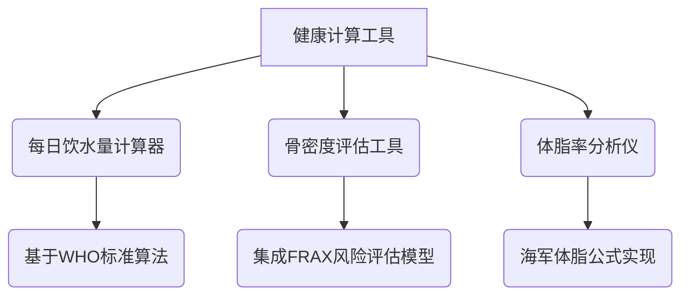

## 健康科普网站开发需求文档（V1.0）

### 一、项目概述
基于AstroPaper技术栈构建全年龄段健康知识科普平台，初期聚焦内容建设与基础架构搭建，未来扩展健康工具模块。目标用户覆盖青少年至老年群体，内容风格要求兼具专业性与趣味性。

---

### 二、核心功能模块
#### 1. 基础架构层
```markdown
✅ 继承AstroPaper原生能力：
- 多设备自适应布局（移动端转化率优化）
- 自动生成sitemap.xml/rss feed（SEO基础配置）
- 动态OG图片生成（社交媒体分享优化）
- 暗黑/明亮双模式（视力保护场景适配）
- 模糊搜索（长尾关键词覆盖）

🔧 定制化改造需求：
- 增加「年龄分层导航」组件（青少年/成年人/老年人）
- 设计健康主题色系（医疗蓝+活力橙组合方案）
- 开发专题聚合页模板（如"骨骼健康周专题"）
```

#### 2. 内容展示层
```markdown
📚 文章管理系统：
- Markdown元数据扩展字段：
  ```
  age_range: [儿童, 青少年, 成人, 老年]
  health_tag: [营养学, 运动科学, 慢性病预防]
  difficulty: [入门, 进阶]
  ```

🎭 互动增强设计：
- 插入「冷知识」浮动提示框组件
- 开发健康知识小测试模块（答题解锁彩蛋内容）
- 添加「一句话总结」侧边栏速览功能
```

#### 3. 工具预研模块


---

### 三、技术实施路径
#### 1. 技术栈选型
```diff
+ 保留AstroPaper核心架构
+ 新增工具类技术方案：
   - 计算工具采用React组件封装（保持交互性）
   - 数据可视化使用D3.js轻量级方案
   - 用户输入校验使用Zod类型库
! 部署方案优化：
   - 工具类页面启用ISR增量静态再生
   - 敏感计算接口部署为Cloudflare Workers
```

#### 2. SEO专项优化
```python
# 示例：健康知识图谱结构化数据
{
  "@context": "https://schema.org",
  "@type": "HealthTopicContent",
  "name": "骨质疏松预防指南",
  "audience": {
    "@type": "PeopleAudience",
    "suggestedMinAge": 45,
    "suggestedMaxAge": 99
  }
}
```

#### 3. 内容安全机制
```bash
# 内容审核流程
Markdown草稿 → 医学专家评审 → 科普化改写 → 多级缓存发布
```

---

### 四、项目里程碑
| 阶段 | 时间窗 | 交付物 | 关键指标 |
|------|--------|--------|----------|
| 基础改造期 | 2025Q2 | 完成主题色系适配建立内容分类体系 | Lighthouse评分≥95 |
| 内容建设期 | 2025Q3 | 上线100篇原创科普实现多年龄导航 | 文章可读性Flesch评分≥70 |
| 工具预研期 | 2025Q4 | 完成3个计算器原型设计建立医学参数库 | 公式误差率≤2% |
| 全球拓展期 | 2026Q1 | 推出英语/西班牙语版本接入Google Health API | 覆盖50+国家/地区 |

---

### 五、风险控制矩阵
1. **医学准确性风险**
   - 应对方案：建立三审制度（医学编辑→主治医师→领域专家）
   
2. **年龄分层争议**
   - 应对方案：采用WHO年龄分段标准+自定义覆盖机制

3. **工具法律合规**
   - 应对方案：所有计算器添加「非诊断建议」声明层

---

### 六、后续行动项
1. 召开医学顾问团组建会议（建议3个工作日内）
2. 启动竞品分析（重点关注：Healthline、WebMD的内容架构）
3. 申请Google Search Console健康垂直权限
4. 建立术语库（中英对照医学词典）

需要优先确认的决策点：
- 是否引入用户画像系统（需评估GDPR合规成本）
- 多语言版本开发优先级策略
- 医疗插图版权采购预算范围

（文档后续可通过`git issue`形式进行迭代更新）

Citations:
[1] https://github.com/satnaing/astro-paper

---
来自 Perplexity 的回答: pplx.ai/share